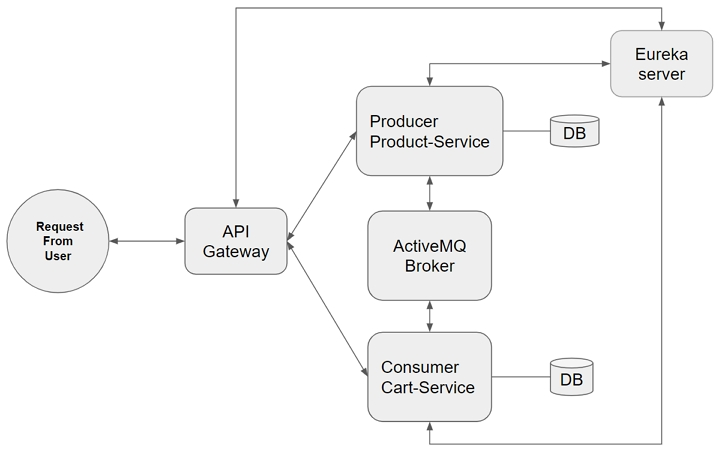

# micro-service-cart-product

**micro-service + ActiveMQ + Spring Cloud Gateway + Eureka**  
각각의 모듈을 붙이며 전체적인 그림을 완성해가는 프로젝트 

 

## 목차

- [전체 구조](#전체-구조)
  - [micro-service with ActiveMQ](#micro-service-with-activemq)
  - [micro-service with API Gateway](#micro-service-with-spring-cloud-gateway)
  - [micro-service with Eureka](#micro-service-with-eureka)

 

## 전체 구조

---

## micro-service with ActiveMQ

> 서로 독립적인 서비스들이 요청을 주고 받기 위해 사용

### architecture

 

[ActiveMQ 사용법 및 Producer, Consumer 설정 정리](https://joomn11.tistory.com/122)

 

## micro-service with Spring Cloud Gateway

> 사용자에게 서비스 구성을 노출시키지 않고 앞단에 라우팅해주는 gateway 서버를 둔다

### architecture

[Spring Cloud Gateway 사용법 및 설정 정리](https://joomn11.tistory.com/123)

 

## micro-service with Eureka

> 물리적 주소가 유동적인 MSA 환경에 ServiceDiscovery, ServiceRegistry 기능을 제공

### architecture

[Spring Cloud Netflix Eureka 사용법 및 설정 정리](https://joomn11.tistory.com/124)
